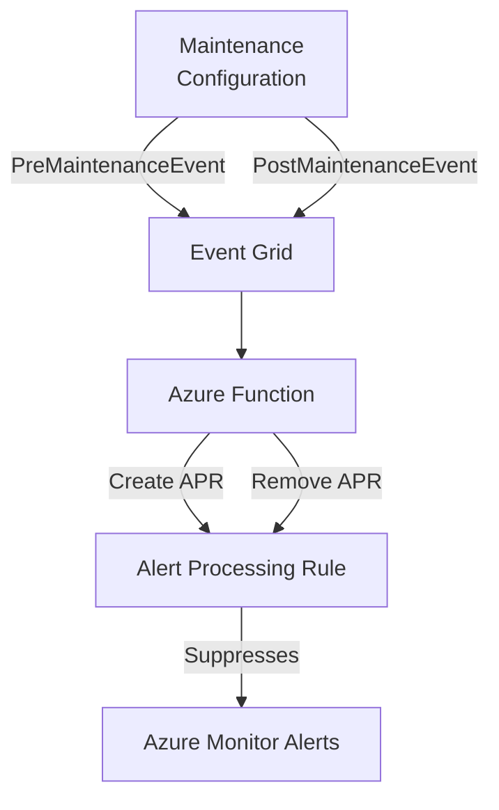

## The Challenge

If you're managing a fleet of Azure Virtual Machines at scale, you've likely implemented [Azure Update Manager](https://learn.microsoft.com/en-us/azure/update-manager/overview) with Maintenance Configurations to keep your VMs patched and secure. While this is a best practice, it introduces a common operational challenge: **alert noise during maintenance windows**.

When VMs reboot during patching:
- Heartbeat alerts fire because the VM is temporarily unreachable
- Application health checks fail
- Metric-based alerts trigger due to resource unavailability

Your operations team gets flooded with false-positive alerts, leading to:
- **Alert fatigue** - Critical alerts get lost in the noise
- **Wasted time** - Engineers investigate non-issues
- **Manual workarounds** - Teams create calendar reminders to manually suppress alerts

What if we could **automatically suppress alerts** when Azure knows a VM is entering a maintenance window?

---

## The Solution: Event-Driven Alert Suppression

Azure Maintenance Configurations emit events through Event Grid when maintenance is about to start and when it completes. We can leverage these events to dynamically create and remove [Alert Processing Rules](https://learn.microsoft.com/en-us/azure/azure-monitor/alerts/alerts-processing-rules) (APRs).

### Architecture Overview



**Flow:**

1. **PreMaintenanceEvent**: Maintenance Configuration signals that maintenance is about to start
2. **Event Grid** delivers the event to an Azure Function
3. **Azure Function** queries Azure Resource Graph to find affected VMs
4. For each VM, creates an **Alert Processing Rule** that suppresses all alerts
5. **PostMaintenanceEvent**: When maintenance completes, the function removes the APRs

---

## Implementation Deep Dive

### 1. Infrastructure Setup (Terraform)

First, let's set up the core infrastructure:

```hcl
# Maintenance Configuration
resource "azurerm_maintenance_configuration" "weekly_patching" {
  name                = "weekly-vm-patching"
  resource_group_name = azurerm_resource_group.maintenance.name
  location            = "westeurope"
  scope               = "InGuestPatch"

  window {
    start_date_time = "2024-01-07 02:00"
    time_zone       = "W. Europe Standard Time"
    duration        = "02:00"
    recur_every     = "1Week Sunday"
  }

  install_patches {
    reboot = "IfRequired"
    
    linux {
      classifications_to_include = ["Critical", "Security"]
    }
    
    windows {
      classifications_to_include = ["Critical", "Security"]
    }
  }
}

# Event Grid System Topic
resource "azurerm_eventgrid_system_topic" "maintenance" {
  name                   = "topic-maintenance-events"
  location               = "westeurope"
  resource_group_name    = azurerm_resource_group.maintenance.name
  source_arm_resource_id = azurerm_maintenance_configuration.weekly_patching.id
  topic_type             = "microsoft.maintenance.maintenanceconfigurations"
}

# Event Subscription to Azure Function
resource "azurerm_eventgrid_system_topic_event_subscription" "maintenance" {
  name                = "subscription-alert-suppression"
  system_topic        = azurerm_eventgrid_system_topic.maintenance.name
  resource_group_name = azurerm_resource_group.maintenance.name

  included_event_types = [
    "Microsoft.Maintenance.PreMaintenanceEvent",
    "Microsoft.Maintenance.PostMaintenanceEvent"
  ]

  azure_function_endpoint {
    function_id                       = "${azurerm_linux_function_app.alert_suppression.id}/functions/Create-AlertProcessingRules"
    max_events_per_batch              = 1
    preferred_batch_size_in_kilobytes = 64
  }
}
```

### 2. Azure Function (PowerShell)

The function receives maintenance events and manages Alert Processing Rules:

```powershell
param($eventGridEvent, $TriggerMetadata)

# Parse event data
$eventType = $eventGridEvent.eventType
$maintenanceConfigId = $eventGridEvent.data.MaintenanceConfigurationId
$subscriptionIds = $eventGridEvent.data.ResourceSubscriptionIds

Write-Host "Processing $eventType for maintenance config: $maintenanceConfigId"

# Helper functions
function Get-ResourceGroupFromId($resourceId) {
    if ($resourceId -match '/resourceGroups/([^/]+)/') {
        return $Matches[1]
    }
    return $null
}

function Get-VmNameFromId($resourceId) {
    if ($resourceId -match '/virtualMachines/([^/]+)$') {
        return $Matches[1]
    }
    return $null
}

# Query affected VMs using Azure Resource Graph
$query = @"
resources
| where type == 'microsoft.compute/virtualmachines'
| where isnotnull(properties.maintenanceConfigurationId)
| where properties.maintenanceConfigurationId =~ '$maintenanceConfigId'
| project id, name, resourceGroup, subscriptionId
"@

$affectedVMs = Search-AzGraph -Query $query -Subscription $subscriptionIds

foreach ($subscriptionId in $subscriptionIds) {
    Set-AzContext -SubscriptionId $subscriptionId | Out-Null
    
    $vmsInSubscription = $affectedVMs | Where-Object { $_.subscriptionId -eq $subscriptionId }
    
    foreach ($vm in $vmsInSubscription) {
        $vmName = Get-VmNameFromId -resourceId $vm.id
        $resourceGroup = Get-ResourceGroupFromId -resourceId $vm.id
        $aprName = "apr-maint-$vmName"
        
        if ($eventType -eq "Microsoft.Maintenance.PreMaintenanceEvent") {
            # Create Alert Processing Rule
            Write-Host "Creating APR: $aprName for VM: $vmName"
            
            New-AzAlertProcessingRule `
                -Name $aprName `
                -ResourceGroupName $resourceGroup `
                -Location "Global" `
                -Scope $vm.id `
                -AlertProcessingRuleType "RemoveAllActionGroups" `
                -Description "Maintenance suppression for VM $vmName" `
                -Enabled $true
        }
        elseif ($eventType -eq "Microsoft.Maintenance.PostMaintenanceEvent") {
            # Remove Alert Processing Rule
            Write-Host "Removing APR: $aprName"
            
            Remove-AzAlertProcessingRule `
                -Name $aprName `
                -ResourceGroupName $resourceGroup
        }
    }
}
```

### 3. Function Configuration

**function.json** - Event Grid trigger binding:

```json
{
  "bindings": [
    {
      "type": "eventGridTrigger",
      "name": "eventGridEvent",
      "direction": "in"
    }
  ]
}
```

**requirements.psd1** - PowerShell dependencies:

```powershell
@{
    'Az.Accounts'         = '4.*'
    'Az.Resources'        = '7.*'
    'Az.ResourceGraph'    = '1.*'
    'Az.AlertsManagement' = '0.*'
}
```

**host.json** - Enable managed dependencies:

```json
{
  "version": "2.0",
  "managedDependency": {
    "enabled": true
  },
  "extensionBundle": {
    "id": "Microsoft.Azure.Functions.ExtensionBundle",
    "version": "[4.*, 5.0.0)"
  }
}
```

---

## Key Design Decisions

### Why One APR Per VM?

Initially, you might consider creating a single APR per subscription with multiple scopes. However, creating **one APR per VM** offers several advantages:

| Approach | Pros | Cons |
|----------|------|------|
| One APR per subscription | Fewer resources to manage | All-or-nothing; can't handle partial failures |
| **One APR per VM** | Granular control; easy troubleshooting; partial success possible | More resources (but they're lightweight) |

### Why Alert Processing Rules Instead of Action Rules?

[Alert Processing Rules](https://learn.microsoft.com/en-us/azure/azure-monitor/alerts/alerts-processing-rules) (APRs) are the newer, recommended approach replacing the deprecated Action Rules. APRs offer:

- Better scope targeting
- Support for all alert types
- Integration with Azure Resource Graph
- Easier management via ARM/Terraform

### Authentication with Managed Identity

The Function App uses a **System-Assigned Managed Identity** to authenticate with Azure. This eliminates the need for stored credentials and follows the principle of least privilege.

Required role assignment:

```hcl
resource "azurerm_role_assignment" "function_monitoring_contributor" {
  scope                = "/subscriptions/${var.target_subscription_id}"
  role_definition_name = "Monitoring Contributor"
  principal_id         = azurerm_linux_function_app.alert_suppression.identity[0].principal_id
}
```

---

## Monitoring the Solution

### Application Insights Queries

Track function executions:

```kusto
traces
| where timestamp > ago(24h)
| where operation_Name == "Create-AlertProcessingRules"
| summarize count() by bin(timestamp, 1h), 
    tostring(customDimensions.eventType)
| render timechart
```

Check for errors:

```kusto
exceptions
| where timestamp > ago(7d)
| where operation_Name == "Create-AlertProcessingRules"
| project timestamp, message, outerMessage, details
| order by timestamp desc
```

### Event Grid Delivery Monitoring

Monitor event delivery in Log Analytics:

```kusto
AzureDiagnostics
| where ResourceProvider == "MICROSOFT.EVENTGRID"
| where Category == "DeliveryFailures"
| project TimeGenerated, Message, _ResourceId
| order by TimeGenerated desc
```

---

## Benefits of This Approach

| Benefit | Description |
|---------|-------------|
| **Zero manual intervention** | Alerts are suppressed automatically based on Azure's maintenance schedule |
| **Precise timing** | Suppression starts exactly when maintenance begins, not based on estimated schedules |
| **Per-VM granularity** | Only affected VMs have alerts suppressed |
| **Automatic cleanup** | APRs are removed when maintenance completes |
| **Centralized management** | All logic is in one function; maintenance configs can span multiple subscriptions |
| **Audit trail** | Full visibility through Application Insights and Event Grid diagnostics |

---

## Limitations and Considerations

1. **Managed Identity permissions**: The function's managed identity needs `Monitoring Contributor` on each target subscription. In large enterprises, this may require coordination with subscription owners.

2. **Cold start latency**: On consumption plan, the function may take 10-30 seconds to cold start. For time-critical scenarios, consider Premium plan.

3. **Resource Graph propagation**: There can be a slight delay between maintenance assignment and Resource Graph reflecting the data.

4. **Multi-region considerations**: Alert Processing Rules are global resources, but you may want to deploy the function in the same region as your Event Grid topics for lower latency.

---

## Conclusion

By combining Azure Maintenance Configurations, Event Grid, and Azure Functions, we've built a fully automated solution that eliminates alert noise during scheduled maintenance windows. This pattern can be extended to other scenarios where you need event-driven infrastructure automation.

The key takeaways:
- **Event Grid** provides the glue between Azure services
- **Azure Functions** with managed identity offers secure, serverless automation
- **Alert Processing Rules** give fine-grained control over alert suppression
- **Resource Graph** enables efficient querying across subscriptions

This approach transforms a manual, error-prone process into a reliable, hands-off automation that scales with your infrastructure.

---

## Resources

- [Azure Maintenance Configurations](https://learn.microsoft.com/en-us/azure/virtual-machines/maintenance-configurations)
- [Event Grid System Topics](https://learn.microsoft.com/en-us/azure/event-grid/system-topics)
- [Alert Processing Rules](https://learn.microsoft.com/en-us/azure/azure-monitor/alerts/alerts-processing-rules)
- [Azure Resource Graph](https://learn.microsoft.com/en-us/azure/governance/resource-graph/overview)
- [Azure Functions PowerShell Developer Guide](https://learn.microsoft.com/en-us/azure/azure-functions/functions-reference-powershell)

---

*Have questions or improvements? Feel free to reach out or contribute to the discussion!*
